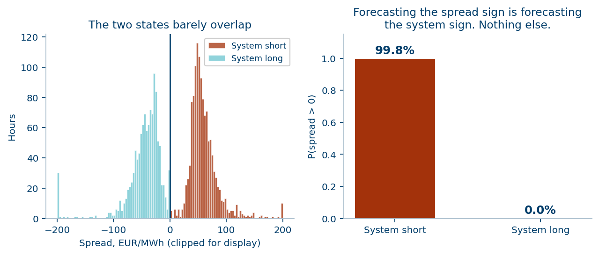
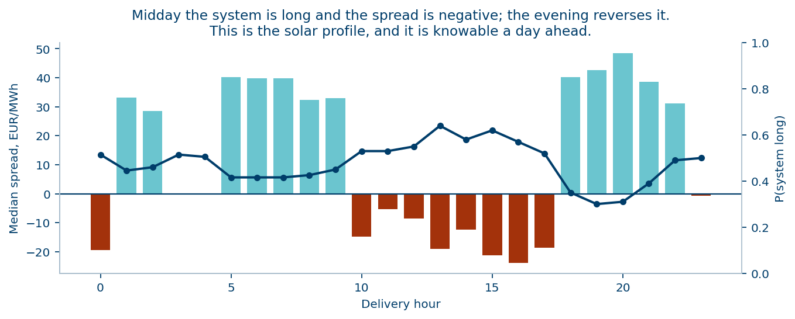
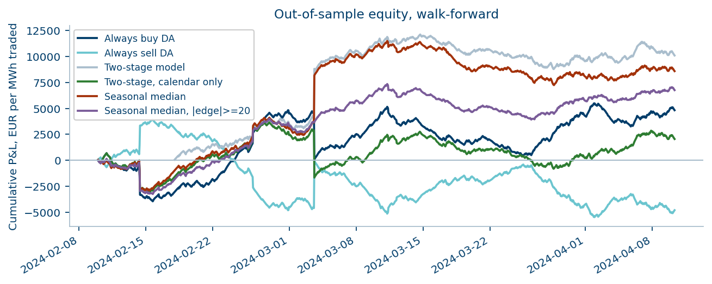
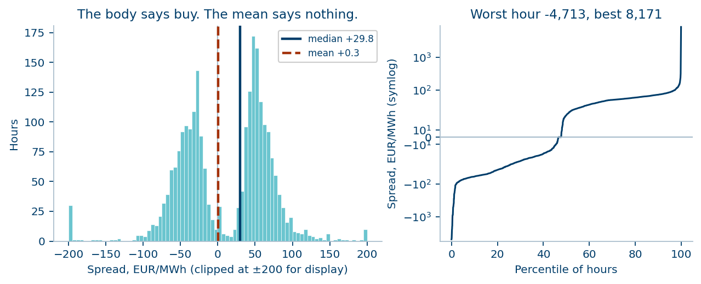
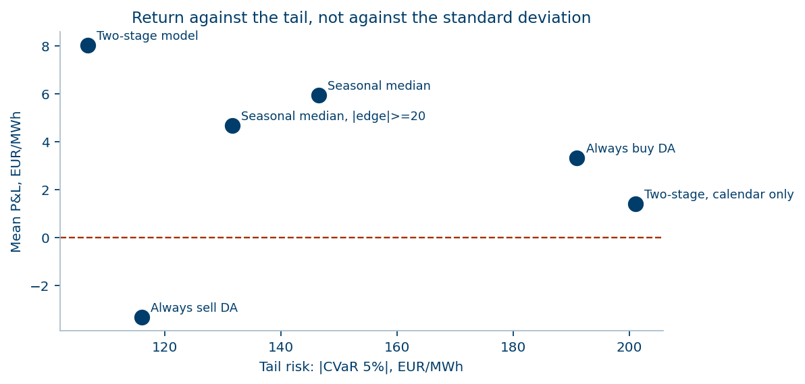

# Day-ahead vs imbalance: a strategy study on the Spanish power market

A quantitative study of a single trade: take a position in the OMIE day-ahead
auction, close it in the REE imbalance market, keep the difference.

There is a small forecastable edge. It is worth about 9 EUR/MWh out of sample —
and it lives almost entirely in one month of the three. Most of the work here is
in establishing that second clause, because without it the first is a
recruitment-exercise fairy tale.

---

## The problem, stated exactly

You may buy or sell in the day-ahead auction and must close in the imbalance
market. The P&L of one MWh has no third case:

```
buy  in day-ahead, sell in imbalance  ->  + (imbalance_price - day_ahead_price)
sell in day-ahead, buy  in imbalance  ->  - (imbalance_price - day_ahead_price)
```

So the whole problem is forecasting the spread `S = P_imbalance - P_DA`, hour by
hour: its sign, then its size.

**Data.** 2,408 hourly observations, 1 January to 10 April 2024: day-ahead price,
imbalance price, system net imbalance volume. No weather, no demand, no
cross-border. That constraint shapes the conclusion.

---

## Four findings

### 1. The spread sign is the system sign

| | P(spread > 0) |
|---|---|
| System **short** (deficit) | **99.8%** |
| System **long** (surplus) | **0.0%** |



Under single imbalance pricing this is close to mechanical. The consequence is
decisive: **forecasting the spread direction and forecasting the system
direction are the same problem**. A perfect forecast of either produces exactly
the same P&L on this data.

Hence a two-stage model — a classifier for direction, a regression for size,
with the classifier's probability as an input to the regression. And hence the
design rule that cost the most to learn: **direction must come from stage 1.**
An earlier version took it from the sign of the regression output; that turned a
classifier with AUC 0.58 into a strategy losing 0.57 EUR/MWh. The regression is
a least-squares fit on a winsorised target — its sign tracks the size of recent
moves, not the direction of the next one. `tests/test_strategy.py` now pins this.

### 2. The system volume tells you the sign, and nothing about the size

Spearman correlation between |imbalance MWh| and |spread|: **−0.006**. Split the
hours into quintiles of system imbalance size and the median |spread| is 49.8,
48.7, 47.5, 49.4, 50.7 — flat.

This kills a tempting line of work. Modelling the joint distribution of volume
and price — a copula, a conditional-variance model on volume — has nothing to
find: the volume is a sign indicator, not a magnitude indicator.

### 3. There is a small directional signal, and it is not where you would expect

The day-ahead auction closes at 12:00 on D-1 for all 24 hours of day D. The
day-ahead price is not an input (it is the outcome of the auction being bid
into), and imbalance outcomes are 13 to 36 hours stale at decision time.
`information.py` encodes this; five tests fail if a feature breaks it.

Under that constraint, walk-forward, refitted daily:

| Model | AUC | Accuracy | Base rate |
|---|---|---|---|
| Logistic regression, calendar + lags | 0.577 | 54.5% | 50.1% |
| **LightGBM, calendar + lags** | **0.580** | **55.3%** | 50.1% |
| Logistic, calendar only | 0.598 | 55.1% | 50.7% |
| Persistence at 24 hours | — | 60.4% | — |

Roughly five points of accuracy over a coin flip. Small, but on a spread whose
median magnitude is 30 EUR/MWh, five points is money.

**The non-linearity is not the difficulty.** LightGBM beats logistic regression
by 0.003 of AUC. A gradient-boosted tree was the obvious thing to try and it was
tried; reporting that it ties is more useful than not having run it.

### 4. What the model finds is mostly the shape of the day



P(system long) runs from 0.30 at hour 20 to 0.64 at hour 14; the median spread
flips with it, −21 EUR/MWh at 16:00 and +48 at 21:00. That is the solar profile
imprinted on the system imbalance, and the clock is known a day ahead.

A one-line seasonal baseline — the median spread per clock hour, refitted daily —
gets most of the way there with no parameters at all. **And a mean-based version
of the same baseline loses money** (−0.51 against +7.66 per MWh). That is the
verdict on conditional-mean time series models here: with a mean of +0.33 and a
median of +29.75, anything fitted to the conditional mean is fitting the tail.

---

## Results

Walk-forward, expanding window, refitted daily. All strategies settle at the
true uncapped spread.

| Strategy | Traded | Mean | 95% CI on the mean | Sharpe | CVaR 5% | Worst hour |
|---|---|---|---|---|---|---|
| *Oracle — system sign (ceiling)* | *99%* | *56.00* | *[49.5, 64.8]* | *38.96* | *+7.9* | *0* |
| **Two-stage, LightGBM** | **100%** | **9.48** | **[1.61, 19.72]** | **6.19** | **−106** | **−441** |
| Two-stage, logistic | 100% | 8.04 | [−0.40, 19.24] | 5.25 | −107 | −441 |
| Seasonal median, \|edge\| ≥ 20 | 70% | 4.66 | [−1.59, 10.60] | 5.63 | −132 | −1,855 |
| Seasonal median | 97% | 5.93 | [−2.73, 16.99] | 3.82 | −147 | −1,855 |
| Two-stage, vol-scaled | 100% | 1.05 | [−0.42, 2.60] | 4.83 | −34 | −121 |
| Always buy day-ahead | 100% | 3.33 | [−6.42, 12.14] | 2.14 | −191 | −4,551 |
| Two-stage, calendar only | 100% | 1.41 | [−6.97, 8.66] | 0.91 | −201 | −4,551 |
| Always sell day-ahead | 100% | −3.33 | [−12.14, 6.42] | −2.14 | −116 | −1,026 |



**Only one strategy has a confidence interval that excludes zero**, and it
excludes it barely, after several candidate models were tried on 101 days of
data. Treat that as a hypothesis worth more data, not as a result.

---

## The number that decides whether to believe any of it

Split the out-of-sample period in half:

| Strategy | First half | Second half |
|---|---|---|
| Two-stage, LightGBM | **+18.50** [+6.00, +37.47] | **+0.47** [−6.86, +7.85] |
| Two-stage, logistic | +19.04 [+5.89, +39.92] | −2.96 [−10.12, +5.10] |
| Seasonal median, \|edge\| ≥ 20 | +9.92 [−1.27, +19.47] | −0.59 [−5.88, +4.72] |

**Every strategy earns its entire result in the first half and nothing in the
second.** Not one of them — all of them, including the parameter-free baseline.
That points at the regime rather than at overfitting a particular model: the
February shape stopped working in late March, which is exactly when Spanish
solar output climbs steeply into spring.

The conclusion is not "this strategy works". It is: *this strategy worked in
February, the mechanism is plausible, and a study on one quarter of data cannot
tell the difference between a seasonal effect and a durable one.*

---

## Risk



The spread has a **median of +29.75 and a mean of +0.33**. The difference is a
tail: worst hour −4,713 EUR/MWh, excess kurtosis 394, and the worst 1% of hours
carry 12% of the naive strategy's absolute P&L.

**Parametric VaR is not merely imprecise here, it is wrong in both directions:**

| Confidence | Gaussian VaR | Historical VaR | |
|---|---|---|---|
| 95% | −464 | −74 | 6× too pessimistic |
| 99% | −657 | −374 | 1.8× too pessimistic |
| 99.9% | −873 | −3,895 | **4.5× too optimistic** |

A Gaussian model overstates ordinary risk and understates the risk that actually
matters. Every measure reported here is historical.



The metric used is the **Sharpe ratio of hourly P&L, never quoted without CVaR
beside it**, plus maximum drawdown, tail concentration (share of absolute P&L
from the worst 1% of hours), and a **block bootstrap by day** for the confidence
interval on the mean.

**On volatility models.** Conditional-variance forecasting is the right idea for
sizing, but the premise fails at this horizon: the autocorrelation of |spread|
is 0.23 at one hour and 0.04 at twenty-four. Since the decision is 13 to 36
hours ahead, there is no persistent variance left to forecast, and a GARCH
specification would be fitting a structure that has already decayed. The
practical version — scaling size by trailing EWMA volatility — is implemented
and behaves accordingly: it cuts the mean from 4.66 to 2.22 and CVaR from −132
to −69, and leaves risk-adjusted return roughly unchanged. **It buys tail
protection, not return.**

---

## What this study does not claim

- Not a live strategy. 101 days, one winter-to-spring window, one price regime,
  and an edge that disappears in the second half of it.
- Several models were tried on one small sample. The one confidence interval
  that excludes zero has not been corrected for that.
- No transaction costs beyond an optional flat `cost_per_mwh`; no market impact,
  no collateral cost.
- Single imbalance pricing is assumed, as the data has one imbalance price.
  Under dual pricing the P&L identity needs a second branch.

## What would settle it

1. **Exogenous forecasts** — wind, solar, demand, and their day-ahead errors.
   These are what drive the system imbalance; their absence is why the
   classifier only reaches 55%. The oracle earns 56.00 against the best
   implementable 9.48, so a genuine imbalance forecast is worth roughly six
   times the entire current edge. That is an argument for buying data, not for a
   bigger model.
2. **More than one quarter**, to separate a seasonal effect from a durable one.
3. **Conditional magnitude modelling.** Direction is settled at 55%; sizing is
   where the remaining edge is, and the vol-scaled variant shows the risk side
   of that is real even when the return side is not.

---

## Repository layout

```
src/omie_imbalance/
    data.py          loading, validation, derived quantities, tail diagnostics
    information.py   gate closure, information lag, the causality guard
    features.py      calendar and lagged features, built to respect that lag
    models.py        two-stage model, seasonal baseline, oracle ceiling
    strategy.py      forecasts -> positions -> P&L
    backtest.py      walk-forward engine, one refit per day
    risk.py          Sharpe, Sortino, VaR, CVaR, drawdown, tail concentration
    plots.py         the five figures in this README
scripts/run_backtest.py       end-to-end run, writes reports/
notebooks/01_analysis.ipynb   the same story, step by step
tests/                        20 tests, six of which exist to catch mistakes
                              that would flatter the result
```

```bash
pip install -r requirements.txt
python scripts/run_backtest.py     # writes reports/ and reports/figures/
pytest -q                          # 20 tests
```

## A note on the tests

Six of them exist only to stop the backtest from lying:

- `test_lag_grows_across_the_delivery_day` — every hour of D is decided at the
  same moment, so hour 23 faces older information than hour 0.
- `test_features_contain_no_contemporaneous_outcome` — no feature reproduces an
  outcome from the delivery hour.
- `test_assert_causal_catches_a_leak` — a negative control: the leak is planted
  deliberately and the guard must fire.
- `test_pnl_identity_long_earns_the_spread` — the identity everything rests on.
- `test_direction_comes_from_the_classifier_not_the_regression` — pins the bug
  described in finding 1, which silently destroyed the signal.
- `test_metric_rejects_the_naive_always_buy` — profitable in total, brutal in
  the tail.

Look-ahead and a mis-wired pipeline are the two failure modes that produce the
most impressive-looking wrong answers. Both seemed worth testing for rather than
promising.

---

*Data: OMIE day-ahead and REE imbalance settlement, January–April 2024.*
